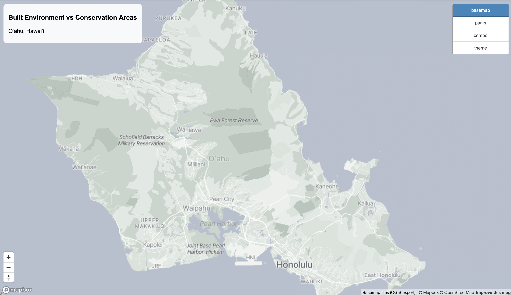
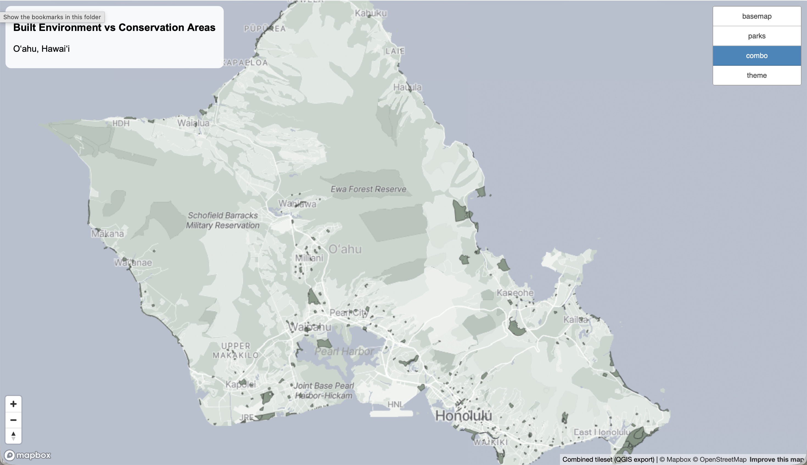
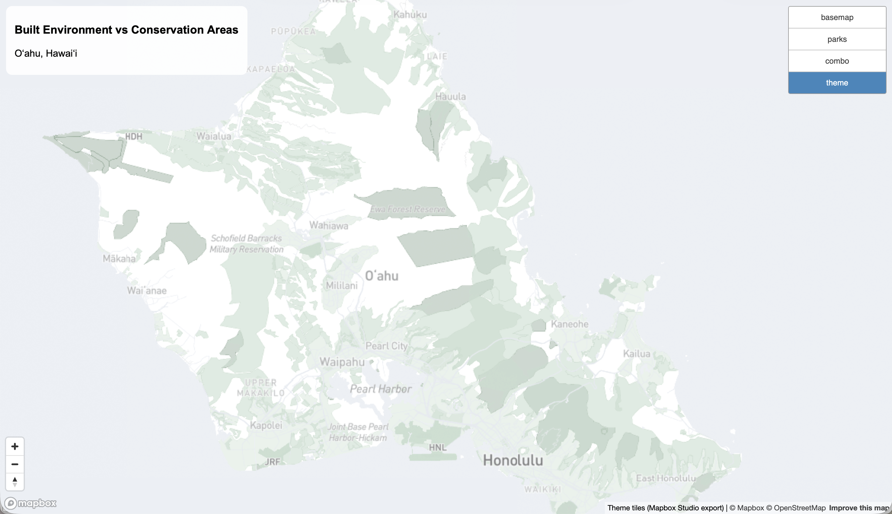

# GEOG 458 Lab 4: O'ahu Map Tiles
*By Shayla Guieb*
[View Map here](https://sjg2202.github.io/oahu-urban-footprint/)

## Examined Geographic Area
This web map focuses on Oʻahu, Hawaiʻi (Honolulu + surrounding districts), highlighting the island’s urban footprint and conserved land areas.
All tilesets were generated at zoom levels 11–15 to provide neighborhood-scale detail while keeping file sizes manageable for web delivery.

### Tileset 1 — Basemap of O'ahu

A custom basemap designed to provide light, low-contrast geographic context for Oʻahu. The subdued styling reduces visual noise so thematic layers can be overlaid without competing for attention.

### Tileset 2 — Thematic Layer: O'ahu Public Parks

A thematic tileset highlighting [public parks and open spaces across Oʻahu](https://honolulu-cchnl.opendata.arcgis.com/datasets/8741314267104512b9d50570dfecc99b_19/explore?location=21.432491%2C-157.927273%2C11).
This layer emphasizes the spatial distribution of accessible green space relative to urbanized areas.

### Tileset 3 — Combined: Basemap & Public Parks

A combined tileset showing the custom basemap with the parks layer. This version demonstrates how thematic information can be integrated directly into a basemap for performance and visual cohesion.

### Tileset 4 — Mapbox Theme: Urban Footprint vs Conservation Core

A custom theme contrasting dense urban areas with conserved and natural landscapes. This theme highlights the human–nature interface on Oʻahu by visually separating development patterns from conservation cores.